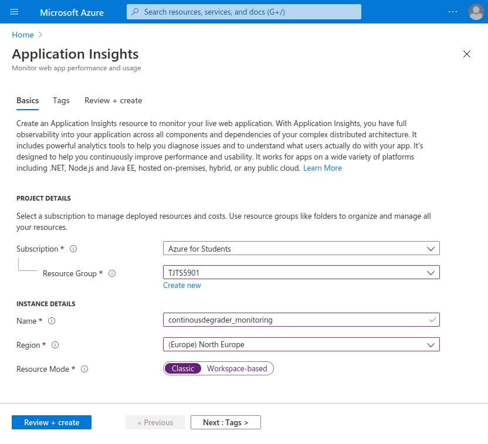
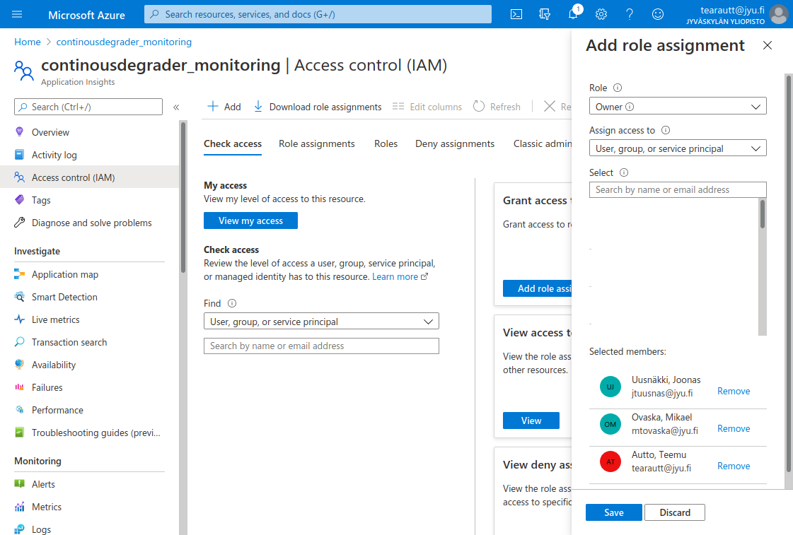

# Monitoring and Logging

Setup python logging, stream it into a Azure for analysis and retention, and create off-site availability monitoring.

[[_TOC_]]

## Logging theory

Logging artifacts that fall into an uncanny valley are most valuable – things that seem normal, but there is something odd about them.

Common layers of logging are defined by Mozilla as [^Securing_DevOps]: 

- **Collection Layer**:
  Takes logs from applications and systems and networks and such. Even from github/gitlab.

- **Streaming Layer**:
  Message broker, queues and delivers logs to different analyzers.

- **Analysis layer**:
  Different things for different tasks. Some for storing logs, some for statistics, and some for anomalies.

- **Storage layer**:
  Recent logs into a database, and older logs into archive.

- **Access layer**:
  Dashboard for human consumption. Being able to create graphs quickly is critical component for incident response.

Thankfully most of the complexity is hidden and implemented by different providers, and we can focus on logging.

For more complex setups one might also log operating system messages. Linux containers could be setup to stream logs into loggin infrastructure. And even for more complex issue traceability, even system calls could be logged. Disk space is cheap, but being able to pinpoint from audit logs exact moment when - and what - unexpected files are opened might be extremely valuable when bisecting security incidents.

## Logging setup

### Basic logging in python

Getting basic logging requires importing `logging` module, and defining both logger instance, and stream handler. Reference implementation in 67af0b7f.

```python
    # Import inbuild logging library
    import logging

    # Setup logging object for current context:
    logger = logging.getLogger(__name__)
    # Define basic config, which sets the handler to print into console by default
    logger.basicConfig(level=logging.DEBUG)
```

Now instead of `print("adsasdfgads")`, you should use `logger.info("adsasdfgads")`, `logger.debug()`, `logger.warn()` and such. See <https://docs.python.org/3/library/logging.html#logging-basic-tutorial>

For more about python logging: <https://docs.python.org/dev/howto/logging.html>

#### Logging exceptions

For exceptions, traces - as in call stacks - are worth logging for bisection purposes. Reference implementation: 85b616fe.

```python
try:
    division_by_zero = 1 / 0
except Exception:
    # exc_info adds trace into log. Commonly used in `.exception`,
    # but can be used on any of the logging methods.
    logging.exception("Caught exception", exc_info=True)
```

See more: <https://docs.python.org/dev/library/logging.html#logging.Logger.exception>

### Adding log streaming

By using OpenCensus framework[^Notice_of_OpenCensus_Deprecation], logs and metrics can be sent to a different analysis and retention services. As it would be somewhat silly to monitor google network within google network, we utilize Azure in thease demos as off-site solution. More for adventurous people another OpenCensus streaming target could be a on-premises [Zipkin](https://opencensus.io/exporters/supported-exporters/python/zipkin/), [Jaeger](https://opencensus.io/exporters/supported-exporters/python/jaeger/). And google fanbois can also add [Stackdriver](https://opencensus.io/exporters/supported-exporters/python/stackdriver/).

#### Setting up Azure Application Insights

<https://docs.microsoft.com/en-us/azure/azure-monitor/app/create-new-resource>

Bonus: Activate student account: <https://azure.microsoft.com/en-us/free/students/>

1. Log into [azure portal](https://portal.azure.com/).

2. From the mainpage, click **➕ Create a resource**

3. From *Marketplace*, find **DevOps** → [**Application Insights**](https://portal.azure.com/#create/Microsoft.AppInsights). Watch out for those nasty tutorial and manual links, they are a trap to catch non-real nerds.

4. From *Application Insights*, fill out project details:
    - **Subscription**: Azure for Students (Billing details)
    - **Resource Group**: `TJTS5901` (or create one indicating your team)
    - **Name**: `<Team_name>_monitoring`
    - **Region**: (Europe) North Europe
    - **Resource Mode**: Classic

    And from the bottom click **[ Review + Create ]**

    


5. From *Validation passed*, click **[ Create ]**

6. Creation takes a second, but when it's done, click on **[ Go To Resource ]**

7. From *Application Insights / overview* take note of **Connection String**, starting `InstrumentationKey=...`

8. From IAM, add your team members as contributors or owners, and mentors (jtuusnas@jyu.fi mtovaska@jyu.fi tearautt@jyu.fi) as *Reader*.
    

#### Adding Azure logging handler

Trace handler integrates into general python logging framework, and streams logging events to Azure.

<https://docs.microsoft.com/en-us/azure/azure-monitor/app/opencensus-python#instrument-with-opencensus-python-sdk-for-azure-monitor>

1. Install required dependencies: `pip install opencensus-ext-azure`

2. Setup logging handler in python code:

    ```python
    import logging
    from opencensus.ext.azure.log_exporter import AzureLogHandler

    # Setup logging object for current context:
    logger = logging.getLogger(__name__)

    # Add azure loghandler. TODO: Set to _your_ connection string.
    connection_string = "InstrumentationKey=...."
    logger.addHandler(AzureLogHandler(connection_string=connection_string))

    # Setting logging level to DEBUG in production might not be the best level.
    logger.setLevel(level=logging.DEBUG)
    ```

    Reference implementation: a863da5f

3. Add some logging entries into your code. For example into map view:

    ```python
    location_count = len(locations)
    if location_count > 0:
        logger.debug("Found %d HiveLocation entries for map." % location_count
    else:
        logger.warn("No hive locations found.")
    ```

4. Interact with your application

5. After a while, go into Azure Application Insights, and from **"Investiogation"** column select **"Transaction Search"** to see your traces.

#### Adding Flask Middleware

By adding flask middleware, we get page metrics to be show in analysis. Detecting health and performance issues gets a bit easier.

<https://docs.microsoft.com/en-us/azure/azure-monitor/app/opencensus-python-request#tracking-flask-applications>

1. Install required dependencies: `pip install opencensus-ext-flask`
2. Integrate opencensus middleware into our flask app:

    ```python
    from flask import Flask

    # Middleware imports - the important ones
    from opencensus.ext.flask.flask_middleware import FlaskMiddleware
    from opencensus.trace.samplers import ProbabilitySampler

    app = Flask(__name__)

    # TODO: Set to _your_ connection string.
    connection_string = "InstrumentationKey=...."

    FlaskMiddleware(
        app,
        exporter=AzureExporter(connection_string=connection_string),
        sampler=ProbabilitySampler(rate=1.0),
    )
    ```

    Rerence implementation: a863da5f


## Off-site availability monitoring

Off site availability checks in most simplest forms that your application is accessible for the world.

### Ping test in Application Insights

See Azure documentation:
<https://docs.microsoft.com/en-us/azure/azure-monitor/app/monitor-web-app-availability>

1. From your application insight, look for **"Availability"** in investigation -category.

2. Click on **"➕ Add test"**

3. In Create test, fill out details:

   - **Name**: `Availability test` or something.
   - **Test type**: URL ping test.
   - **URL**: `http://Your-deployment-address.com`
   - **Parse dependent requests**: Yes. Check that all the assets on page are also available.
   - In **Success criteria**, fill out **Content must contain** to something specific for your page. Title of your page, or copyright notice if you have such.1
   - **Alerts**: Enabled.

4. After couple of minutes, refresh views and you should see "Ping test" has completed successfully.

5. Bonus: Setup alerting rule so that your "Operative" team gets an actual alert, via email or sms or whatnot.

---

[^Securing_DevOps]: Securing DevOps, Julien Vehent, 2018
[^Notice_of_OpenCensus_Deprecation]: OpenCensus is being replaced by OpenTelemetry at some future point.
