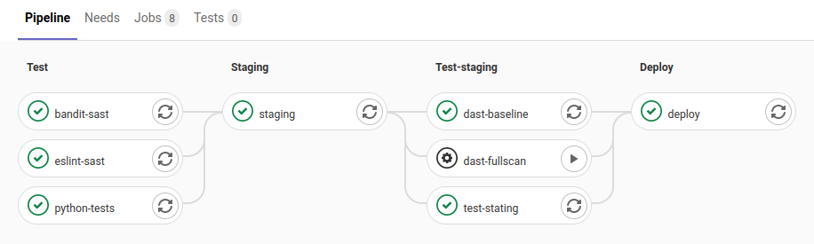

# Setting up staging



Reference implementation: f5a21c32

[[_toc_]]

## Quickstart

- Create Google App Engine deployment file `app-staging.yaml` and add `service: staging` 
- Setup new `staging` stage in pipeline before actual deployment and add deployment into staging
- Extra: Add stage to test if staging works before deploying into production.

## Setup

### Generate config file for staging.

- Copy `app.yaml` into `app-staging.yaml`
- Add `service: staging` into `app-staging.yaml`:
    ```yaml
    runtime: python38
    service: staging
    
    handlers:
        # [--]
    ```

### Setup staging stage into pipeline

Edit `.gitlab-ci.yaml`:

- Add into pipeline stages `staging` and optionally `test-staging`.
    ```yaml
    stages:
      - test
      - staging
        # Optional step to run tests agains staged deployment.
      - test-staging
      - deploy
    ```

- Setup staging job by copying your production deployment, but set it to be run at `staging` stage by changing `stage: production` to `stage: staging`, deployment command to use `app-staging.yaml`, and `environment: name:` to `staging`:
  ```yaml
  staging:
    # [--]
    stage: staging
    environment:
        name: staging
    # [--]
    script:
        # ... other commands ...
        - gcloud --quiet --project $PROJECT_ID app deploy app-staging.yaml
    # [--]
    only:
        - master
  ```

### Bonus: Testing staging

To test staging, we need to know staging url, define and create tests for it. Tests can be run either from different test suite (defaults to `tests/`), or by marking some tests to be specific for staging. Lets try using marking.

- add `test-staging` job to `.gitlab-ci.yaml`:
    ```yaml
    test-stating:
        # Test that staging stage works as expected
        stage: test-staging
        image: python:3
        script:
            - pip install pytest
            # Run tests that has been marked by "@pytest.mark.staging"
            - pytest --verbose tests -m "staging"
    ```

- Tell tests where to find staging setup. If you're using other tests, like security scanning, setup it into `.gitlab-ci.yaml` `variables:` section, or in gitlab ci/cd variables. In `.gitlab-ci.yaml`:
    ```yaml
    variables:
        WEBSITE_STAGING: https://staging-dot-<your-project-id>.ew.r.appspot.com
        # [--]
    ```

    If you are unsure of your staging address, try running `gcloud --project <your-project-id> app browse -s staging --no-launch-browser`

- Create pytest marker for staging tests. In `tests/` create `conftest.py`.
    ```python
    def pytest_configure(config):
        # Declare custom marker for staging tests. See: https://docs.pytest.org/en/latest/mark.html
        config.addinivalue_line(
            "markers", "staging"
        )
    ```

- Create test `tests/test_staging.py` that tries fetching webpage from staging deployment, and mark it with our `staging` marker:
    ```python
    import unittest
    import pytest
    import requests

    # Only run tests when "staging" has been marked.
    @pytest.mark.staging
    class AvailabilityTest(unittest.TestCase):
        def test_availability(self):
            """Fetch web page and check "200" is returned as status code.

            See explanation for status codes:
            https://en.wikipedia.org/wiki/List_of_HTTP_status_codes#2xx_success
            """

            # Get the webpage, and check status code
            url = os.getenv("WEBSITE_STAGING")
            status_code = requests.get(url).status_code

            # Compare returned status code to A-OK result (200)
            self.assertEqual(
                status_code,
                200,
                f"Website {url!r} availability failed. Returned code was {status_code!r}.",
            )
    ```

- Edit your general unittest pipeline job in `.gitlab-ci.yaml` so it wont run staging test by adding `-m "not staging"` switch for pytest:
    ```yaml
    python-tests:
        #[--]
        script:
            #[--]
          - pytest --verbose tests --cov --cov-report term --cov-report html -m "not staging"
    ```

## Bonus

Instead of one specific staging setup, use version specific staging setups. This can be accomplished by using gcloud deployment with `--no-promote` and `--promote`. Now you can run staging tests against branches, not only master.
